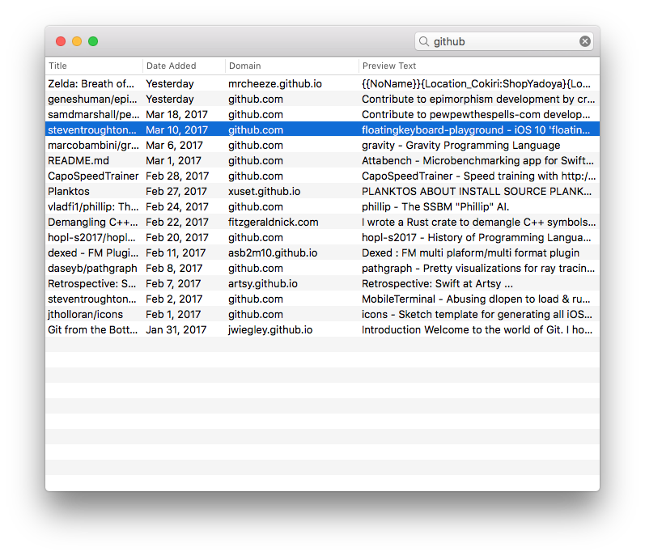

This little app uses private API to display Safari’s Reading List. It has a few features:

- sort and filter by title, date, domain and preview text
- multiple selection
- add new items by dragging & dropping URLs into the main window 
- open selected items in the default browser by pressing return (hold option to open in background)
- remove selected items by pressing delete

Disclaimer
----------
I built this on macOS 10.12.3 (16D32). Future or past versions will probably break it. Do not use this code in a shipping product. Do not link against private frameworks. Do not ingest. For entertainment purposes only.

Credits and Shouts Out
----------------------
h/t Jonathan Wight ([@schwa](https://twitter.com/schwa)) for [prompting me](https://twitter.com/rydermackay/status/845406758214516737
) to waste an evening on this :P
